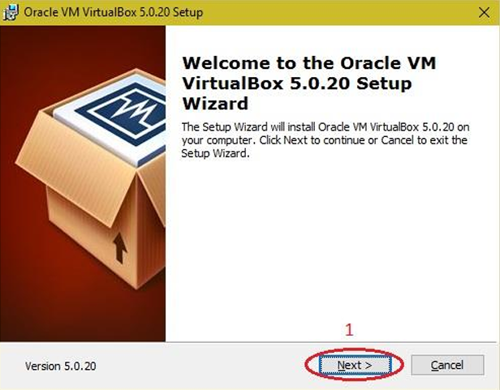

# Experiment 1: Install VirtualBox/VMware Workstation with Linux or Windows OS

## Aim
To Install Virtualbox / VMware Workstation with different flavours of linux or windows OS.

## Procedure

### 1. Install VirtualBox/VMware Workstation with different flavors of linux or windows OS on top of windows7 or 8.
- Download the Virtual box exe and click the exe file…and select next button.

- Click the next button.

- Click the next button.

- Click the YES button.

- Click the install button…

- Then installation was completed. The show virtual box icon on desktop screen….

## Results

The experiment for 'Install VirtualBox/VMware Workstation with Linux or Windows OS' was successfully implemented, configured, and verified.