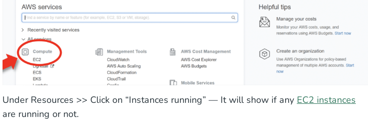
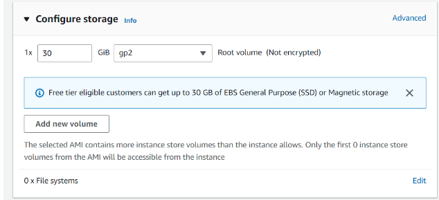
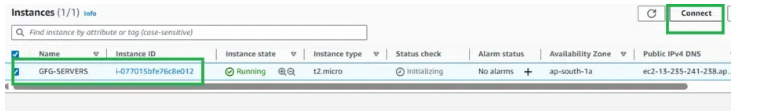
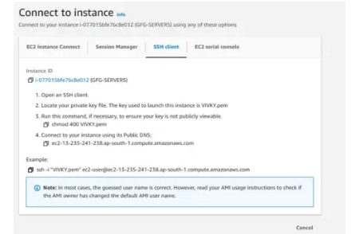
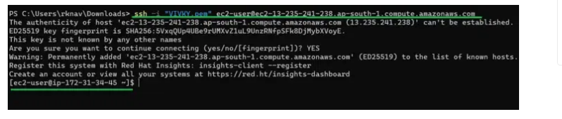

# Experiment 3: Create EC2 Instance in AWS (Amazon)

## Aim
To provision and launch an Amazon Elastic Compute Cloud (EC2) instance on Amazon Web Services (AWS) and connect to it using an SSH key-pair.

## Procedure

### Launching an EC2 Instance

#### Step 1: Navigate to EC2 Console
Log in to your AWS Console. Click on the **Services** menu in the top-left corner, and select **EC2** from the Compute section.

#### Step 2: Initialize Launch Settings
Click the **Launch Instance** button. In the creation form, configure the basic options such as naming your virtual machine.

#### Step 3: Select an Operating System (AMI)
Choose an Amazon Machine Image (AMI) corresponding to the operating system you require. Select a **Free tier eligible** OS (such as Amazon Linux 2 or Ubuntu Server) to avoid charges.

#### Step 4: Configure Instance Type and Key Pair
Select your hardware resource profile (instance type). The **t2.micro** (or **t3.micro** depending on region) is selected by default and is Free Tier eligible. You can also generate or select an SSH key-pair (`.pem` file) here to secure access to the instance.

#### Step 5: Configure Storage and Network Settings
Ensure the network settings (VPC, Subnet, Security Group) are configured properly. By default, Free Tier accounts are eligible for up to 30 GB of Amazon Elastic Block Store (EBS) storage volume.

#### Step 6: Review and Launch Instance
Verify that all configuration selections are eligible for the Free Tier, then click **Launch instance**. Once created, your virtual machine will begin booting.

---

### Connecting to the EC2 Instance via SSH

#### Step 1: Open the Connection Dialog
In the EC2 Dashboard, select your running virtual machine from the instances list, and click **Connect** at the top.

#### Step 2: Copy SSH Connection Details
Go to the **SSH client** tab. Copy the sample command provided at the bottom of the screen, which uses your private key pair (`.pem` file) to authenticate connection to the instance.

#### Step 3: Open Terminal and Connect
Open your local terminal and navigate to the directory where your `.pem` key file is saved. Run the copied command to connect to your instance.

## Results

The AWS EC2 instance was successfully created, launched, and accessed using SSH authentication.